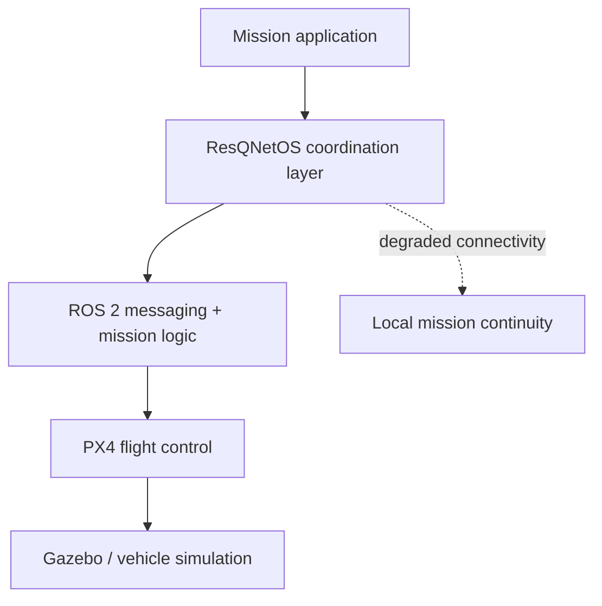

# ResQNetOS

**Simulation-first infrastructure for resilient autonomous drone-swarm missions.**

ResQNetOS is a hackathon prototype exploring how multi-drone systems can coordinate missions using **ROS 2, PX4, and Gazebo**, with an emphasis on extensibility and degraded-connectivity operation.

## Core architecture



## Core idea

Instead of treating each drone as a one-off application, ResQNetOS treats swarm behavior as an operating layer: mission logic sits above the flight stack and can be extended through reusable applications.

## Repository scope

This repository contains the prototype software and setup material used to demonstrate the concept in simulation. The current implementation is **not a production flight-control system** and should not be interpreted as hardware-validated swarm autonomy.

## Technology

- Ubuntu 24.04 LTS
- ROS 2 Jazzy
- PX4 Autopilot / SITL
- Gazebo
- Python
- Flask for the prototype application marketplace

## Running the simulation

The exact local setup depends on the PX4 / ROS 2 environment. The intended demo flow is:

1. Launch a PX4 SITL vehicle in Gazebo.
2. Start the communication bridge / ROS 2 environment.
3. Verify estimator and vehicle readiness.
4. Run a mission application through the ROS 2 workspace.

Example PX4 simulation command:

```bash
cd ~/PX4-Autopilot
make px4_sitl gz_x500
```

Then source the ROS 2 workspace and run the mission package configured by the project.

## Design goals

- **Simulation first** — test mission logic without risking hardware.
- **Modular missions** — separate reusable mission applications from the underlying flight stack.
- **Resilience** — explore local autonomy and mission continuity when connectivity is unreliable.
- **Extensibility** — make it possible to add domain-specific swarm behaviors without rebuilding the entire stack.

## Current limitations

- The repository represents a hackathon-stage prototype.
- Hardware flight testing is outside the scope of the current codebase.
- LoRa / rural-connectivity support and some resilience mechanisms described in the original concept remain roadmap items.
- Safety-critical deployment would require extensive hardware-in-the-loop testing, formal failure handling, and operational validation.

## Direction

ResQNetOS is ultimately an experiment in **software-defined autonomy**: giving drone fleets a common mission layer that can survive imperfect infrastructure and support multiple real-world applications.